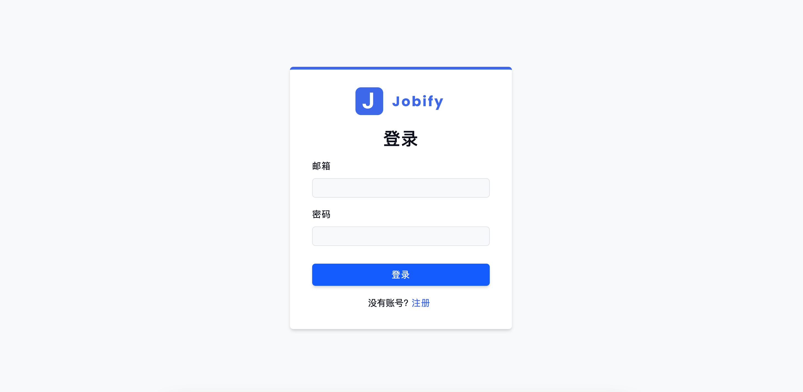
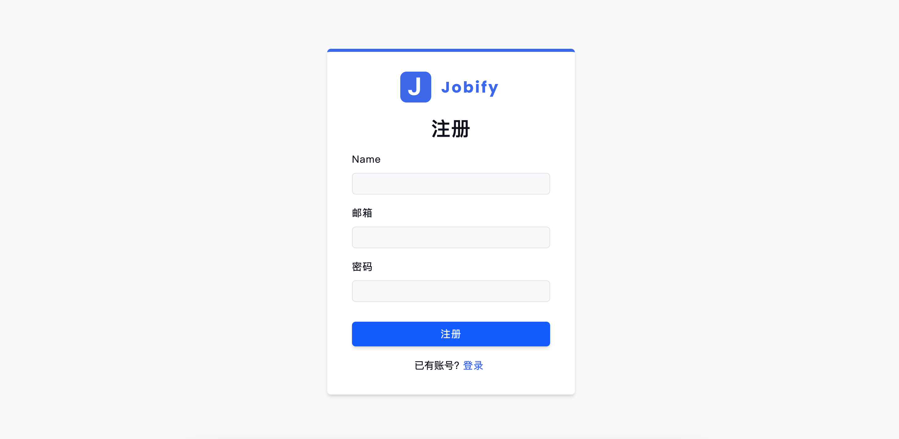
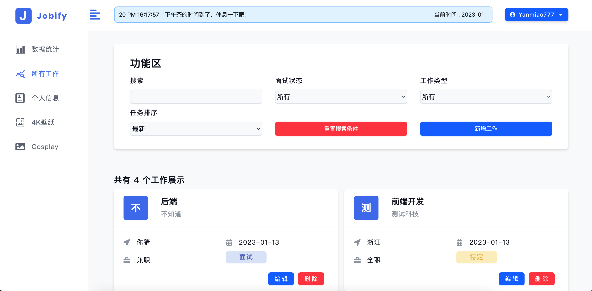
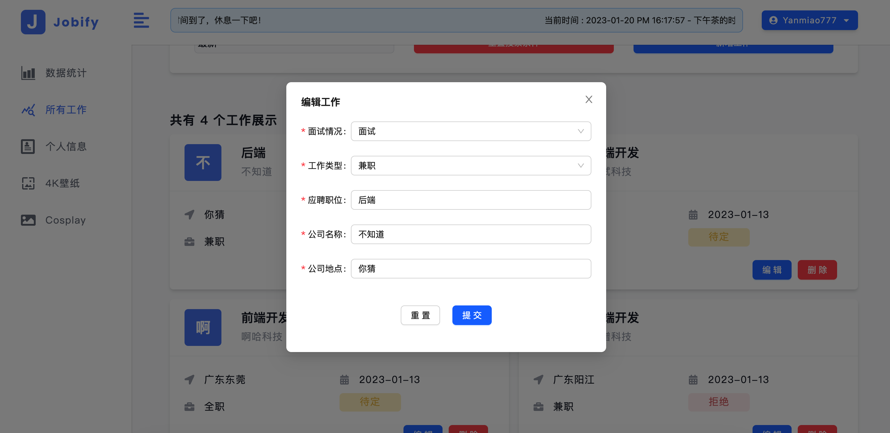
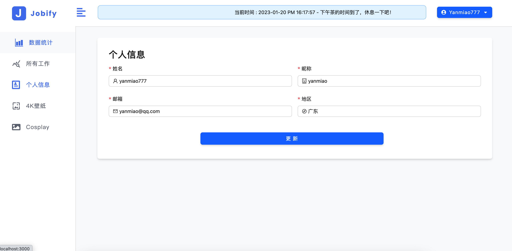
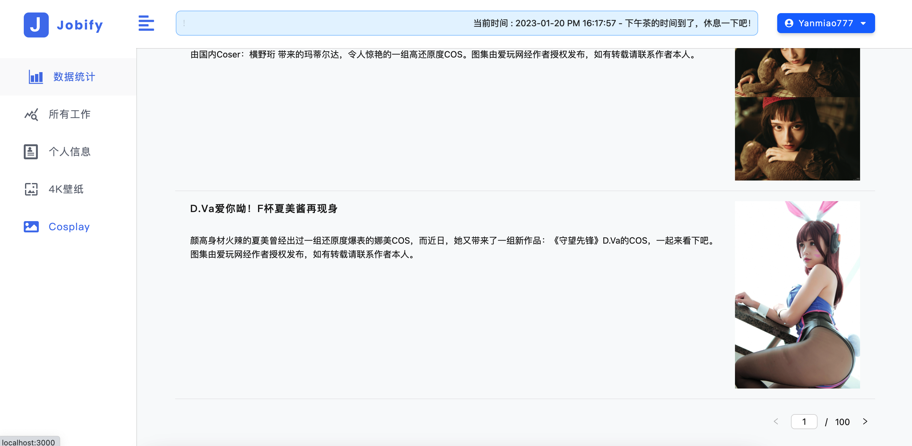

### day 代表的含义

1. day1 react 核心基础
2. day2 ustState基础使用 + List 列表实现
3. day3 useEffect基础使用 + Form 实现
4. day4 useRef基础使用 + useReducer基础使用 + useContext基础使用
5. day5 propTypes传参类型检测 + react-router基础使用
6. day6 react-router5 基础使用 + 路由嵌套 + 路由传参
7. management-system  管理系统项目实战
8. react-job-api 管理系统项目 api 接口 
   1. 关于 mongodb 的启动
   2. [(43条消息) Mac 关于MongoDB数据库的安装和设置全局环境变量_Luck Young的博客-CSDN博客](https://blog.csdn.net/Mote123/article/details/104558165)
   3. `mongod --config /usr/local/mongodb/mongo/conf/mongo.conf`
   4. node的启动命令  npm run server

测试用户 : 

账号 : yanmiao@qq.com

密码 : yanmiao














#### 推荐看的博文( react 知识点 )

- [(43条消息) 耗时一个月，React 知识点万字大总结（超全超基础）_萌萌哒の瑞萌萌的博客-CSDN博客_react知识点](https://blog.csdn.net/weixin_46232841/article/details/124505088)

- [(43条消息) React知识点_barnett_y的博客-CSDN博客_react知识点](https://blog.csdn.net/sinat_17775997/article/details/121767902)


#### React 创建脚手架命令

   ```js
   npx create - react - app < 名称 >
   ```


#### jsx规则

    1. return 只能返回一个根标签
    2. 根标签可以是 div / section /React.Fragment/ <></> , 其中 React.Fragment 和 <></> 是为了不渲染标签, 类似 vue 的 trmplate
    3. html 属性名使用驼峰命名法
    4. 如果需要使用 class 类名 , 则必须使用 className 代替
    5. 每个标签必须有封闭的 /


#### react Hooks

      1. hooks 主要针对`无状态组件`
      2. 无状态组件是 函数
      3. 有状态组件是 类


#### react 函数组件传参 父传子，子传父

- [react 函数组件传参 父传子，子传父 - 简书 (jianshu.com)](https://www.jianshu.com/p/26a83ddb38c5)


#### jsx 中引入图片要么使用 import 要么使用 require

- 如果使用 require 在 jsx 中使用表达式则必须要在后面加上 default

- [(43条消息) 2022-05-23 工作记录--React-jsx中引入图片_小呀小萝卜儿的博客-CSDN博客_jsx图片](https://blog.csdn.net/weixin_48850734/article/details/124937524)


#### jsx map 中不能使用 if 作为条件判断

- 可以使用三元表达式
- [(43条消息) jsx种map循环中使用if判断_withwz_的博客-CSDN博客](https://blog.csdn.net/weixin_42519137/article/details/98357205)


#### useReducer 介绍和基本使用

[(43条消息) useReducer 介绍和基本使用_Jas555的博客-CSDN博客_usereducer](https://blog.csdn.net/Jas3000/article/details/124168218)


#### 多层组件传值

1. 属性传值(多层就麻烦) 
2. useContext(多层)
3. redux(复杂点)


#### useContext

[useContext使用 - 简书 (jianshu.com)](https://www.jianshu.com/p/cc91178724d5)


#### react UI 库

1. umi https://umijs.org/docs/introduce/introduce
2. ant design https://ant.design/docs/spec/introduce-cn
3. ant mobile https://mobile.ant.design/zh


#### react router 5

[React Router 5 完整指南 - 掘金 (juejin.cn)](https://juejin.cn/post/6966242922278682632)

```tsx
//switch：映射第一个，匹配到一个以后就不继续匹配了，性能更好
//replace：路由跳转使用replace模式，默认push模式
//exact：精准匹配查找
```

[reactRouter5 - 简书 (jianshu.com)](https://www.jianshu.com/p/261dd479328e)


[(46条消息) React学习06-React Router 6_Havoc.Wei的博客-CSDN博客](https://blog.csdn.net/baidu_41248654/article/details/128496701)


### 项目开发中不错的网站 

#### favicon

[The best Favicon Generator (completely free) - favicon.io](https://favicon.io/)

#### svg 矢量图 

[unDraw - Open source illustrations for any idea](https://undraw.co/)


### 1月14号, 今天没更新 

#### react 渲染 html , 类似v-html
``` html
<div dangerouslySetInnerHTML={{__html: imgUrl}}></div>
```
